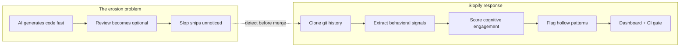
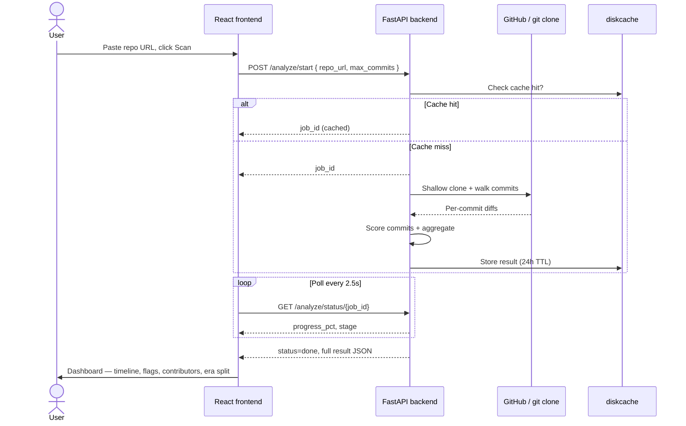
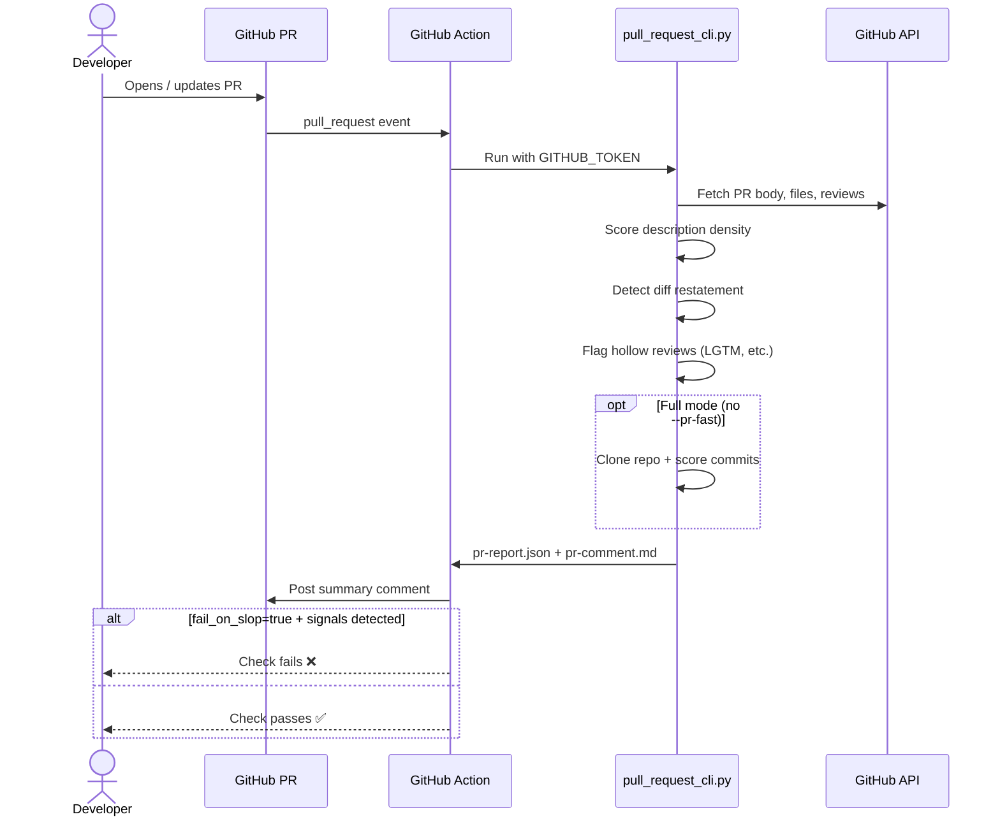
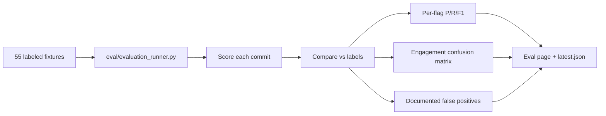
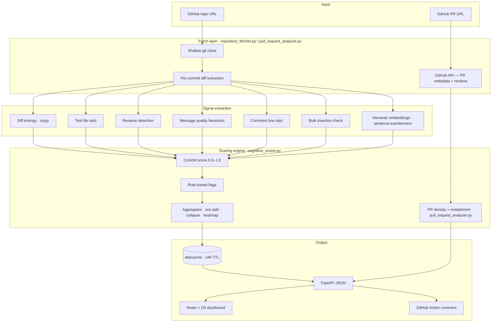
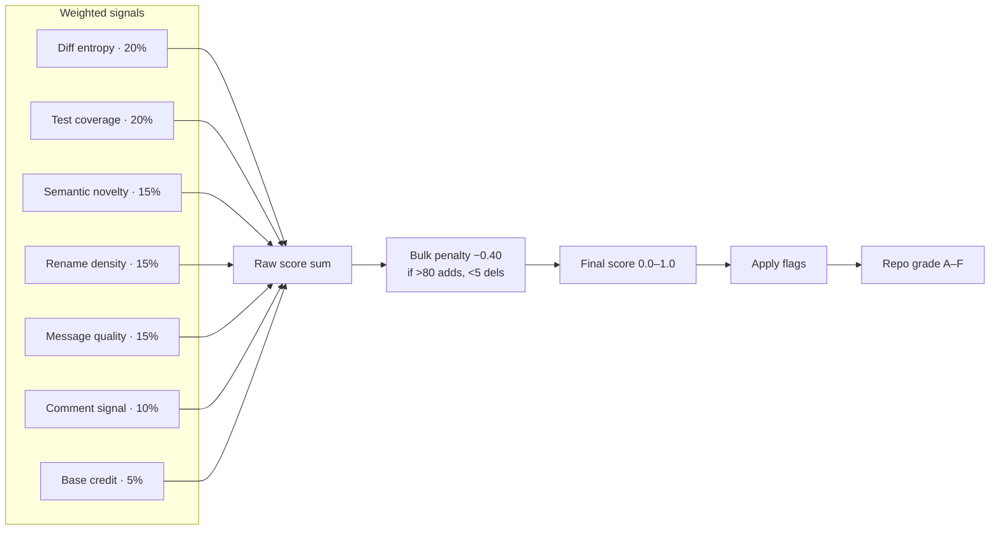
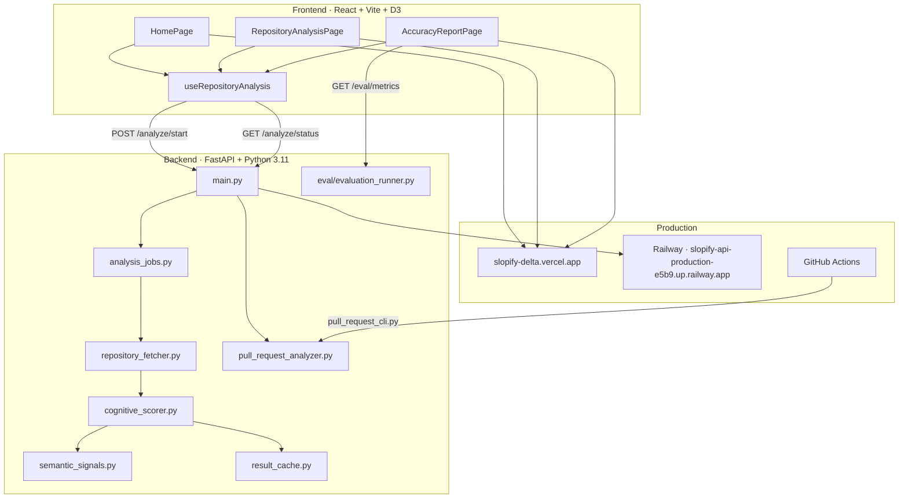
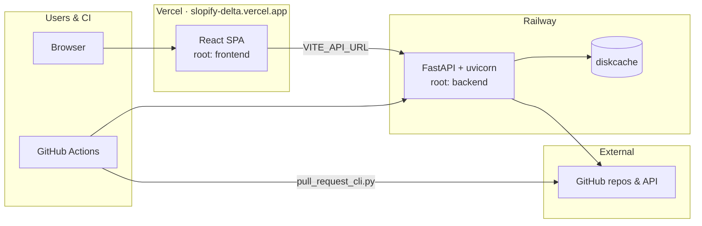

# Slopify

> **"Was this code understood?"**

**Team Avenger · [Slop Scan Hackathon](https://raptors.dev) · Track A — Code Review**

[](https://slopify-delta.vercel.app/)
[](https://slopify-api-production-e5b9.up.railway.app/health)
[](https://github.com/shallyvarshney239-ai/slopify)
[](LICENSE)

Slopify reconstructs **human cognitive depth** from git history. It does not ask *"Was this AI-generated?"* It asks *"Was this verified, understood, and genuinely reviewed before merging?"*

*"Slop"* was the 2025 Word of the Year — digital content produced in quantity without human review. In code review, that looks like hollow PR descriptions, rubber-stamp approvals, and bulk pastes merged without tests. Slopify catches those patterns using **behavioral signals** in commits and pull requests — not keyword lists, not GPTZero wrappers, and not another LLM guessing authorship.

---

## Live demo

| Resource | URL |
|----------|-----|
| **Web app** | [https://slopify-delta.vercel.app](https://slopify-delta.vercel.app/) |
| **API** | [https://slopify-api-production-e5b9.up.railway.app](https://slopify-api-production-e5b9.up.railway.app/health) |
| **Accuracy report** | [https://slopify-delta.vercel.app/accuracy](https://slopify-delta.vercel.app/accuracy) |
| **Source code** | [github.com/shallyvarshney239-ai/slopify](https://github.com/shallyvarshney239-ai/slopify) |

**Try a scan:**

```
https://slopify-delta.vercel.app/analysis?repo=https://github.com/expressjs/morgan
```

**Demo repos:**

```
https://github.com/expressjs/morgan
https://github.com/expressjs/cors
https://github.com/sindresorhus/ora
```

### Demo video

_Add your 4-minute walkthrough URL here before submission._  
Script: [docs/VIDEO_SCRIPT.md](docs/VIDEO_SCRIPT.md) · Short outline: [docs/DEMO.md](docs/DEMO.md)

---

## Table of contents

- [Hackathon context](#hackathon-context)
- [Quick start](#quick-start)
- [User workflows](#user-workflows)
- [What it does](#what-it-does)
- [How detection works](#how-detection-works)
- [Implementation map](#implementation-map)
- [Detection accuracy](#detection-accuracy-honest-numbers)
- [GitHub Action](#github-action-install-on-monday)
- [Scoring system](#scoring-system)
- [Dashboard](#dashboard)
- [Architecture & deployment](#architecture--deployment)
- [Submission checklist](#submission-checklist)
- [License](#license)

---

## Hackathon context

**Slop Scan** (May 29 – Jun 1, 2026) asks builders to create tools that catch low-effort AI content before it wastes anyone's time. The question is no longer *"was this made with AI?"* — it's *"did a human actually check this?"*

### Track A — Code Review

Slopify targets **Track A** directly:

| Slop Scan asks for | Slopify delivers |
|--------------------|------------------|
| Detect hollow AI-generated PR artifacts | PR description density + diff-restatement scoring |
| Surface commits where humans didn't read the AI output | Per-commit Cognitive Engagement Score + flags |
| Score PR descriptions for information density | `description_density`, `hollow_description` signals |
| Analyse commit patterns for bulk AI contributions | Bulk insertion penalty, `paste_and_pray`, era split |

### What we deliberately avoid

Per hackathon rules, these approaches **do not score well** and are **not used**:

| Out of scope | Slopify alternative |
|--------------|---------------------|
| Keyword detectors (em-dash bingo) | Shannon entropy + structural diff analysis |
| GPTZero / Originality.ai wrappers | Custom behavioral scoring engine |
| Asking an LLM *"is this AI?"* | Rule-based flags + embedding similarity |
| Shaming AI use | Surfaces review quality, not authorship |

### Bonus challenges

| Challenge | Points | Status |
|-----------|--------|--------|
| **The Bake-Off** | +5 | ✅ 55 labeled fixtures, confusion matrix at `/accuracy` |
| **Live Fire** | +5 | ✅ Runs on real public GitHub repos and PRs |
| **Open Source Ready** | +3 | ✅ CI, Docker, CONTRIBUTING.md, GitHub Action |
| **Cross-Track Scanner** | +3 | ✅ Shared density engine for commits + PR text |

### Scoring alignment

| Criterion | Weight | How Slopify addresses it |
|-----------|--------|--------------------------|
| Detection accuracy | 30% | Published eval: 95.2% engagement accuracy, per-flag F1, documented FPs |
| Practical usefulness | 25% | GitHub Action, shareable URLs, one-command Docker setup |
| Technical execution | 20% | FastAPI + React, background jobs, caching, CI pipeline |
| Innovation | 15% | Cognitive engagement reconstruction — hard to fake without actually reviewing |
| Presentation & demo | 10% | Interactive dashboard, era split, collapse detection, eval page |



---

## Quick start

```bash
git clone https://github.com/shallyvarshney239-ai/slopify
cd slopify
docker compose up
```

| Service | Local URL |
|---------|-----------|
| Landing page | http://localhost:5173 |
| Results dashboard | http://localhost:5173/analysis?repo=https%3A%2F%2Fgithub.com%2Fexpressjs%2Fmorgan |
| Accuracy report | http://localhost:5173/accuracy |
| API health | http://localhost:8000/health |

**Local dev:** Python 3.11+ and Node 20+. See [CONTRIBUTING.md](CONTRIBUTING.md).

---

## User workflows

### Workflow 1 — Scan a public repo (web)



### Workflow 2 — Analyze a pull request (web)

1. On the home page, choose **Pull request** and paste a URL like `github.com/owner/repo/pull/123`.
2. Optional: enable **Quick PR scan** for description/review signals only (skips commit analysis).
3. Open the report at `/analysis/pr?pr=...` — verdict, density metrics, hollow reviews, export Markdown.

```
https://slopify-delta.vercel.app/analysis/pr?pr=https://github.com/expressjs/morgan/pull/1
```

### Workflow 3 — Analyze a pull request (CI)



### Workflow 3 — Evaluate detection accuracy (Bake-Off)



Run locally: `cd backend && python scripts/run_evaluation.py --fast`

---

## What it does

### Repository analysis

- **Cognitive Engagement Score** (0.0–1.0) per commit from 6 weighted behavioral signals
- Suspicious pattern flags: **Paste & Pray**, **Rubber Stamp**, **Silent Commit**, **Test Desert**
- Positive signals: **Deep Refactor**, **Test Driven**
- D3 **cognitive timeline** with collapse event detection
- **AI era split** — before/after GPT-4 release (March 14, 2023)
- **File risk map** — files repeatedly touched during low-engagement commits
- **Contributor trust index** — per-author scores with sparkline trends
- Repo health grade **(A–F)** and shareable results URLs

### Pull request analysis

- PR description **information density** vs boilerplate phrases
- **Diff restatement** — embedding similarity between body and auto-generated diff summary
- **Hollow review** detection — LGTM-only or diff-parroting comments
- Configurable threshold for CI pass/fail

### CI integration

- Composite GitHub Action posts markdown summary on every PR
- Optional `--fail-on-slop` to block merges below threshold

---

## How detection works

### End-to-end processing pipeline



### Per-commit scoring



### What we detect vs what we skip

| We detect | We do not detect |
|-----------|------------------|
| Bulk paste without tests | Whether code was written by Copilot |
| Near-zero engagement across all signals | Author intent or identity |
| PR bodies that restate the diff | Private repos (without token) |
| LGTM-style hollow reviews | Squashed history hiding intermediate slop |
| Engagement collapse over time | Careful humans merging bad code with good messages |

Full methodology: [docs/DETECTION.md](docs/DETECTION.md)

---

## Implementation map

| Module | File | Responsibility |
|--------|------|----------------|
| API entry | `backend/main.py` | Routes, CORS, background jobs, eval endpoint |
| Git fetch | `backend/analyzer/repository_fetcher.py` | Shallow clone, per-commit diff extraction, progress callbacks |
| Semantic NLP | `backend/analyzer/semantic_signals.py` | `all-MiniLM-L6-v2` embeddings, novelty + message quality |
| Commit scoring | `backend/analyzer/cognitive_scorer.py` | Weighted score, flags, era split, collapse, heatmap |
| PR scoring | `backend/analyzer/pull_request_analyzer.py` | Description density, diff restatement, hollow reviews |
| Cache | `backend/analyzer/result_cache.py` | diskcache, 24h TTL, preloaded demo repos |
| Jobs | `backend/analyzer/analysis_jobs.py` | Async job queue + status polling |
| Eval harness | `backend/eval/evaluation_runner.py` | Bake-Off metrics, confusion matrix, failure cases |
| PR CLI | `backend/scripts/pull_request_cli.py` | GitHub Action entry point |
| Frontend hook | `frontend/src/hooks/useRepositoryAnalysis.js` | Start job, poll status, retry on timeout |
| Dashboard | `frontend/src/pages/RepositoryAnalysisPage.jsx` | Full analysis UI with D3 charts |
| Eval UI | `frontend/src/pages/AccuracyReportPage.jsx` | Live accuracy report |
| CI action | `.github/actions/slopify/action.yml` | Composite PR check + comment |



---

## Detection accuracy (honest numbers)

Evaluated on **55 labeled commits** — Slop Scan **Bake-Off** deliverable. Live report at `/accuracy` (legacy `/eval` redirects).

| Metric | Value |
|--------|-------|
| Engagement accuracy (clear bucket) | **95.2%** (42 commits evaluated) |
| `paste_and_pray` F1 | **1.00** |
| `deep_refactor` F1 | **0.94** |
| `rubber_stamp` F1 | **0.44** (high recall — catches all low-engagement; some FPs) |
| Documented false positives | 2 |

**Engagement confusion matrix** (thresholds: low < 0.35, high ≥ 0.55):

|  | Predicted low | Predicted high |
|--|---------------|----------------|
| **Actual low** | 25 | 0 |
| **Actual high** | 2 (FP) | 15 |

**Documented failure cases** (judges asked for honest numbers):

| ID | Scenario | Why it failed |
|----|----------|---------------|
| `trap-fp-01` | Large feature shipped without unit tests | High line count + zero tests mimics paste |
| `trap-fp-04` | Dependency lockfile bump | Mechanical bulk change, low engagement signals |

Regenerate: `cd backend && python scripts/run_evaluation.py --fast`

---

## GitHub Action (install on Monday)

Add to any workflow — posts a PR comment and optionally fails the check:

```yaml
name: Slopify PR check

on:
  pull_request:
    types: [opened, synchronize, reopened]

permissions:
  contents: read
  pull-requests: write

jobs:
  slopify:
    runs-on: ubuntu-latest
    steps:
      - uses: actions/checkout@v4

- uses: ./.github/actions/slopify
  with:
    github_token: ${{ secrets.GITHUB_TOKEN }}
          threshold: "0.35"
          post_comment: "true"
          fail_on_slop: "false"
```

See [docs/GITHUB_ACTION.md](docs/GITHUB_ACTION.md) · Example: [.github/workflows/slopify-pr-example.yml](.github/workflows/slopify-pr-example.yml)

---

## Scoring system

### Signals and weights

| Signal | Weight | What it measures |
|--------|--------|-----------------|
| Diff entropy | 0.20 | Shannon entropy of changed tokens — paste tends to be repetitive |
| Test coverage delta | 0.20 | Ratio of test files changed — tests signal comprehension |
| Semantic novelty | 0.15 | Embedding distance from previous commit diff |
| Rename density | 0.15 | Renames per files changed — renaming requires understanding |
| Message quality | 0.15 | Specificity, length, issue references in commit message |
| Comment signal | 0.10 | Ratio of comment lines added |
| Base credit | 0.05 | Minimum score for any commit |
| Bulk insertion penalty | −0.40 | >80 lines added, <5 deleted — the Paste & Pray fingerprint |

```
raw_score = diff_entropy*0.20 + test_score*0.20 + semantic_novelty*0.15
          + rename_score*0.15 + message_quality*0.15 + comment_score*0.10 + 0.05
final_score = max(0.0, raw_score - bulk_penalty)
```

### Health grades

| Grade | Range | Meaning |
|-------|-------|---------|
| A | ≥ 0.70 | High engagement — humans understand their commits |
| B | 0.55 – 0.69 | Good engagement with some gaps |
| C | 0.40 – 0.54 | Mixed signals — inconsistent review quality |
| D | 0.25 – 0.39 | Low engagement — rubber-stamping detected |
| F | < 0.25 | Critical — widespread blind acceptance |

### Flags

| Flag | Condition | Meaning |
|------|-----------|---------|
| `paste_and_pray` | Bulk insert + zero tests | Large paste accepted without validation |
| `rubber_stamp` | Score < 0.15 | Near-zero cognitive signal |
| `test_desert` | >50 additions + zero tests | Significant code, no test coverage |
| `silent_commit` | Message quality < 0.15 | No intent in commit message |
| `deep_refactor` ✓ | >2 renames | Positive — genuine comprehension |
| `test_driven` ✓ | Tests ≥ 40% of changed files | Positive — strongest signal |

### AI era split

Split at **March 14, 2023** (GPT-4 release). Computes mean score, high-engagement %, and Paste & Pray rate before/after with verdict: `significant_decline` · `moderate_decline` · `stable` · `improvement`.

---

## Dashboard

| Section | What it shows |
|---------|---------------|
| Summary stats | Mean score, health grade, high engagement %, flag counts |
| AI era split | Before/after GPT-4 delta with verdict |
| Cognitive timeline | D3 scatter, trend line, collapse bands, GPT-4 marker |
| Score distribution | Histogram with mean line |
| Contributor trust index | Per-author score, trend, sparkline |
| Flagged commits | Filterable list — click to inspect |
| Commit inspector | Score breakdown, diff stats, flag explanations |
| File risk map | Files touched during low-engagement commits |
| Accuracy report (`/accuracy`) | Bake-Off metrics, confusion matrix, failure cases |
| PR analysis (`/analysis/pr`) | Description density, hollow reviews, risky commits |
| Export toolbar | Copy link, download Markdown, print/PDF on repo and PR reports |

---

## Architecture & deployment

### Production stack



### API endpoints

| Method | Path | Description |
|--------|------|-------------|
| `POST` | `/analyze` | Synchronous repo analysis |
| `POST` | `/analyze/start` | Start background job → `job_id` |
| `GET` | `/analyze/status/{job_id}` | Poll progress + result |
| `GET` | `/repos/validate` | Verify repo exists before scan |
| `GET` | `/prs/validate` | Verify PR exists before scan |
| `POST` | `/analyze/pr` | Start PR analysis job (`skip_commit_analysis` optional) |
| `GET` | `/analyze/pr/status/{job_id}` | PR job status |
| `GET` | `/eval/metrics` | Bake-Off accuracy report |
| `GET` | `/health` | Healthcheck |
| `GET` | `/preloaded` | Pre-cached demo repos |

### Environment variables

```bash
cp backend/.env.example backend/.env
cp frontend/.env.example frontend/.env.local
```

| Variable | Where | Production value |
|----------|-------|------------------|
| `VITE_API_URL` | Vercel | `https://slopify-api-production-e5b9.up.railway.app` |
| `SKIP_PRECACHE` | Railway | `1` |
| `SLOPIFY_CACHE_DIR` | Railway | `/tmp/slopify_cache` |
| `GITHUB_TOKEN` | Railway / GHA (optional) | Higher API rate limits |

### Deploy steps

**Backend → Railway**

1. New Project → Deploy from GitHub → root directory: `backend`
2. Builder: Dockerfile · domain: `slopify-api-production-e5b9.up.railway.app`
3. Env: `SKIP_PRECACHE=1`, `SLOPIFY_CACHE_DIR=/tmp/slopify_cache`

**Frontend → Vercel**

1. Import GitHub repo → root directory: **`frontend`**
2. Env: `VITE_API_URL=https://slopify-api-production-e5b9.up.railway.app`
3. Deploy → live at [slopify-delta.vercel.app](https://slopify-delta.vercel.app/)

**Local**

```bash
docker compose up
```

### ML / NLP stack

| Tool | Purpose |
|------|---------|
| `sentence-transformers` (all-MiniLM-L6-v2) | Commit message + diff embeddings |
| `scipy.stats.entropy` | Shannon entropy of diff tokens |
| `sklearn cosine_similarity` | Semantic novelty between commits |
| `gitpython` | Repo cloning and commit walking |
| `diskcache` | Result caching (24h TTL) |
| `D3.js` | Timeline, histogram, sparklines |

---

## Submission checklist

Aligned with Slop Scan deliverables:

| Requirement | Status |
|-------------|--------|
| Working tool (not a slide deck) | ✅ Repo + PR scanner with live dashboard |
| Actual detection logic explained | ✅ [docs/DETECTION.md](docs/DETECTION.md) + scoring above |
| Honest accuracy numbers | ✅ 95.2% engagement accuracy, published FPs |
| Runnable locally (`docker compose up`) | ✅ |
| Public GitHub repo | ✅ [github.com/shallyvarshney239-ai/slopify](https://github.com/shallyvarshney239-ai/slopify) |
| Live API deployed | ✅ [slopify-api-production-e5b9.up.railway.app](https://slopify-api-production-e5b9.up.railway.app/health) |
| Live frontend | ✅ [slopify-delta.vercel.app](https://slopify-delta.vercel.app/) |
| Demo video | ⬜ Add 2–3 min walkthrough URL |

---

## Notes

- Public repos only — no GitHub token required for basic scanning
- Era split requires ≥5 commits on each side of March 14, 2023
- File heatmap requires files touched in ≥2 commits
- Large repos: use lower `max_commits` (50–100) for faster results
- Results cached for 24 hours per repo + depth combination
- Scores are comparative signals for review prioritization, not verdicts on individuals

---

## License

MIT — Copyright (c) 2026 Team Avenger
