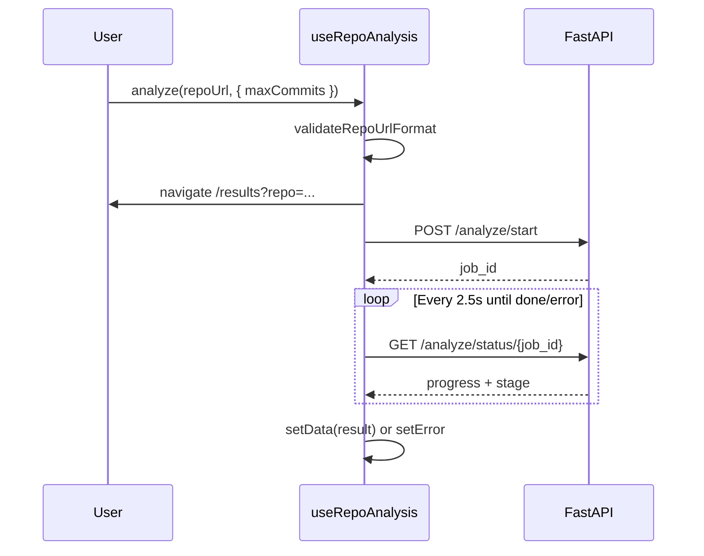

# Slopify Frontend — Complete Technical Documentation

**Author:** Team Avenger  
**Repository:** https://github.com/shallyvarshney239-ai/slopify  
**Live app:** https://slopify-delta.vercel.app  
**API base:** `VITE_API_URL` → `https://slopify-api-production-e5b9.up.railway.app` (no trailing slash)

---

## Table of contents

1. [Executive summary](#1-executive-summary)
2. [Technology stack](#2-technology-stack)
3. [Directory structure](#3-directory-structure)
4. [Application architecture](#4-application-architecture)
5. [Routing](#5-routing)
6. [API integration](#6-api-integration)
7. [Design system: theme, colors, typography](#7-design-system-theme-colors-typography)
8. [Layout and positioning](#8-layout-and-positioning)
9. [Data flow](#9-data-flow)
10. [File-by-file reference](#10-file-by-file-reference)
11. [Component catalog](#11-component-catalog)
12. [Styling layers](#12-styling-layers)
13. [Environment and deployment](#13-environment-and-deployment)
14. [Unused / legacy artifacts](#14-unused--legacy-artifacts)

---

## 1. Executive summary

The Slopify frontend is a **single-page application (SPA)** built with **React 18** and **Vite 5**. It presents a marketing landing experience (neon cyberpunk aesthetic) and two analytical views:

- **Results dashboard** — cognitive engagement analysis for a scanned GitHub repository
- **Eval page** — published Bake-Off accuracy metrics from the backend

All repository analysis is **asynchronous**: the client starts a job via `POST /analyze/start`, then polls `GET /analyze/status/{job_id}` until completion. State for analysis is centralized in the custom hook `useRepositoryAnalysis` and passed from `App.jsx` to `HomePage` and `RepositoryAnalysisPage`.

**Positioning (product):** Slopify measures whether code was **understood before merge**, not whether it was AI-generated. The UI uses forensic / neural-signal language (“consciousness,” “biometric signals,” “evidence”) while the backend uses behavioral git metrics.

---

## 2. Technology stack

| Layer | Technology | Purpose |
|-------|------------|---------|
| Build | Vite 5 | Dev server (port 5173), production bundle to `dist/` |
| UI | React 18 | Components, hooks, client state |
| Routing | react-router-dom 6 | `BrowserRouter`, `/`, `/analysis`, `/accuracy` (+ legacy redirects) |
| HTTP | axios | REST calls to FastAPI backend |
| Charts | D3.js 7 | Timeline, histogram, sparklines |
| Animation | framer-motion 11 | Landing page scroll reveals, loading screen |
| Scroll UX | react-intersection-observer | Signal cards animate when in view |
| Dates | date-fns 3 | Formatting commit timestamps |
| Utilities | clsx | (installed; minimal direct use in current tree) |

---

## 3. Directory structure

```
frontend/
├── index.html              # HTML shell, meta, OG tags, #root mount
├── package.json            # Dependencies and scripts
├── package-lock.json       # Lockfile
├── vite.config.js          # Vite + React plugin, port 5173
├── vercel.json             # SPA rewrites, build commands
├── .env.example            # VITE_API_URL template
├── .env.local              # Local/prod API URL (gitignored)
├── public/
│   ├── favicon.svg
│   └── logo.svg
└── src/
    ├── main.jsx            # React DOM entry, global CSS imports
    ├── App.jsx             # Router + shared analysis hook
    ├── config/
    │   └── routes.js       # ROUTES + LEGACY_ROUTES
    ├── hooks/
    │   └── useRepositoryAnalysis.js
    ├── utils/
    │   └── repositoryUrl.js
    ├── pages/
    │   ├── HomePage.jsx
    │   ├── RepositoryAnalysisPage.jsx
    │   └── AccuracyReportPage.jsx
    ├── components/         # UI components (see catalog)
    └── styles/
        ├── globals.css     # Analysis/accuracy/nav design system
        └── homePage.css    # Neon landing page theme
```

---

## 4. Application architecture

```
┌─────────────────────────────────────────────────────────────┐
│  index.html → main.jsx                                       │
│    ├── globals.css + homePage.css                            │
│    └── App.jsx                                               │
│          ├── BrowserRouter                                   │
│          └── AppRoutes                                       │
│                ├── useRepositoryAnalysis() ← shared state    │
│                ├── NavigationBar (all routes)                │
│                └── Routes                                    │
│                      ├── /         → HomePage(analysis)      │
│                      ├── /analysis → RepositoryAnalysisPage│
│                      └── /accuracy → AccuracyReportPage      │
│                      (legacy /results, /eval → redirect)     │
└─────────────────────────────────────────────────────────────┘
                              │
                              ▼
                    FastAPI (VITE_API_URL)
```

**State ownership:**

| State | Owner | Consumers |
|-------|--------|-----------|
| `data`, `loading`, `error`, `job`, `analyze` | `useRepositoryAnalysis` | `HomePage`, `RepositoryAnalysisPage`, `NavigationBar` (loading) |
| `selectedCommit` | `RepositoryAnalysisPage` local | `EngagementTimelineChart`, `FlaggedCommitsList`, `CommitDetailPanel` |
| Eval metrics | `AccuracyReportPage` local | `EngagementConfusionMatrix`, `EvalFailureGallery` |

---

## 5. Routing

Configured in `src/App.jsx` and `src/config/routes.js` with `react-router-dom` v6.

| Path | Component | Query params | Purpose |
|------|-----------|--------------|---------|
| `/` | `HomePage` | — | Marketing + repo URL input + demo pills |
| `/analysis` | `RepositoryAnalysisPage` | `repo` (required for auto-scan), `max_commits` (optional, default 200) | Full analysis dashboard |
| `/accuracy` | `AccuracyReportPage` | — | Bake-Off metrics from backend |
| `/analysis/pr` | `PullRequestAnalysisPage` | `pr`, `quick` (optional) | PR scan dashboard |
| `/results` | — | (legacy) | Redirects to `/analysis` preserving query string |
| `/eval` | — | (legacy) | Redirects to `/accuracy` |

**SPA behavior:** `vercel.json` rewrites all paths to `/index.html` so direct links like `/analysis?repo=...` work on Vercel.

**Navigation triggers:**

- User submits URL on landing → `analyze()` → `navigate('/analysis?repo=...&max_commits=...')`
- User opens `/analysis?repo=...` directly → `useEffect` in `RepositoryAnalysisPage` calls `analyze()`
- `NavigationBar`: `Link to="/"`, `Link to="/accuracy"`, external GitHub repo link
- Footer on landing: `Link to="/accuracy"`

**Redirect guard:** If `/analysis` has no `repo` query and no data/loading/error, `RepositoryAnalysisPage` redirects to `/`.

---

## 6. API integration

Base URL from `getApiBase()` in `utils/repositoryUrl.js`:

```javascript
import.meta.env.VITE_API_URL || 'http://localhost:8000'
// trailing slashes stripped to avoid //analyze/start 404
```

### 6.1 Endpoints used by the frontend

| Method | Endpoint | Used in | Request body / params | Response usage |
|--------|----------|---------|----------------------|----------------|
| `POST` | `/analyze/start` | `useRepoAnalysis.startWithRetry` | `{ repo_url: string, max_commits: number }` | `{ job_id, cached?: boolean }` |
| `GET` | `/analyze/status/{job_id}` | `useRepoAnalysis.pollJob` | — | Job object: `status`, `progress_pct`, `stage`, `updated_at`, `result`, `error` |
| `GET` | `/eval/metrics` | `EvalPage.load` | `refresh=true` optional | Full eval JSON (fixtures, F1, confusion matrix) |

| `GET` | `/repos/validate` | `validateRepositoryWithApi` | Pre-scan before repo jobs |
| `GET` | `/prs/validate` | `validatePullRequestWithApi` | Pre-scan before PR jobs |
| `POST` | `/analyze/pr` | `usePullRequestAnalysis` | `{ pr_url, skip_commit_analysis }` |
| `GET` | `/analyze/pr/status/{job_id}` | `usePullRequestAnalysis.pollJob` | PR job progress + result |

**Also available but not used in SPA:** `/analyze` (sync), `/health`, `/preloaded`.

### Export and share

`ReportExportToolbar` on repository and PR dashboards: copy current URL, download Markdown (`exportRepositoryReport.js` / `exportPullRequestReport.js`), print/PDF via browser print styles.

### 6.2 Job lifecycle (client)



**Polling parameters:**

- Interval: **2500 ms**
- Status poll timeout: **60 s** per request
- Start request timeout: **180 s** if `max_commits >= 200`, else **90 s**
- Start retries: **3** attempts on timeout only
- Max consecutive poll failures: **12** (404 → “lost connection to job” message)
- Stall detection: if `running` and `updated_at` older than **900 s** → error

**Result validation on `done`:** Requires `result.summary` and `result.commits` array; otherwise shows invalid result error.

### 6.3 Expected analysis `result` shape (dashboard)

The Results page expects the backend payload roughly as:

```typescript
{
  repo_url: string
  repo_name: string
  total_commits_analyzed: number
  summary: {
    mean_cognitive_score: number
    high_engagement_pct: number
    paste_and_pray_count: number
    rubber_stamp_count: number
    collapse_events: Array<{ timestamp, commit_sha, score_before, score_after, drop_magnitude }>
    // ...
  }
  era_split?: { pre_ai, post_ai, delta, delta_pct, verdict }
  file_heatmap?: Array<{ path, commit_count, mean_score, paste_and_pray_hits }>
  commits: Array<{
    sha, author, timestamp, message, cognitive_score, flags[],
    semantic_novelty, message_quality, diff: { ... }
  }>
  contributors: Array<{ author, commit_count, mean_score, score_trend, paste_and_pray_pct }>
}
```

### 6.4 Eval metrics shape

```typescript
{
  mode: 'fast' | 'full'
  fixture_count: number
  engagement: { thresholds, evaluated_count, accuracy, confusion_matrix, failures }
  flag_metrics: Record<flagName, { precision, recall, f1, support }>
  limitations: string[]
}
```

---

## 7. Design system: theme, colors, typography

### 7.1 Dual visual modes

| Mode | Stylesheet | Pages | Aesthetic |
|------|------------|-------|-----------|
| **Forensics / dashboard** | `globals.css` | `/results`, `/eval`, NavBar | Dark navy, red accent, monospace data, scan-line overlay |
| **Neon cyberpunk** | `landing.css` | `/` (LandingPage) | Cyan/magenta/green neon, grid floor, glass panels, terminal mock |

### 7.2 CSS variables (`globals.css` `:root`)

| Token | Value | Role |
|-------|-------|------|
| `--bg-primary` | `#050508` | Page background |
| `--bg-secondary` | `#0c0c14` | Cards, panels |
| `--bg-surface` | `#141420` | Elevated surfaces |
| `--text-primary` | `#e8e8f0` | Body text |
| `--text-secondary` | `#7a7a9d` | Labels |
| `--text-tertiary` | `#4a4a6a` | Muted meta |
| `--green` | `#39ff14` | High engagement / positive |
| `--amber` | `#ffd700` | Warning / medium |
| `--red` | `#ff2a6d` | Danger / low engagement |
| `--blue` | `#58a6ff` | Links, repo name |
| `--purple` | `#a5a3e8` | GPT-4 era line (timeline) |
| `--font-display` | Space Grotesk | Headings (landing overlap) |
| `--font-sans` | Inter | UI text |
| `--font-mono` | JetBrains Mono | SHAs, scores, terminal |

### 7.3 Neon palette (`landing.css` `:root`)

| Token | Typical use |
|-------|-------------|
| `--neon-cyan` `#00f3ff` | Primary glow, entropy signal |
| `--neon-purple` `#bc13fe` | Secondary accent |
| `--neon-pink` `#ff2a6d` | Alerts, CTA glow |
| `--neon-green` `#39ff14` | Positive signals |
| `--neon-gold` `#ffd700` | Intent / warning signals |
| `--bg-deep` `#030308` | Landing background |

### 7.4 Score color convention (shared logic)

Used across `SummaryStats`, `CommitInspector`, `FlagList`, `FileHeatMap`, D3 charts:

| Score range | Color | Meaning |
|-------------|-------|---------|
| ≥ 0.60 | `#39ff14` | High engagement |
| 0.35 – 0.59 | `#ffd700` | Mixed |
| < 0.35 | `#ff2a6d` | Low engagement |

**Health grades** (`SummaryStats`): A ≥0.70, B ≥0.55, C ≥0.40, D ≥0.25, F below.

### 7.5 Flag colors (`FlagList`, `CommitInspector`)

| Flag key | Color |
|----------|-------|
| `paste_and_pray`, `rubber_stamp` | `#ff2a6d` |
| `test_desert`, `silent_commit` | `#ffd700` |
| `deep_refactor`, `test_driven` | `#39ff14` |

---

## 8. Layout and positioning

### 8.1 Global layout

- **NavBar:** Sticky top bar (`.navbar` in globals), full width, logo left, links right
- **Results shell:** `.results-shell` — `max-width: 1200px`, centered, `padding: 32px`, vertical flex gap `32px`
- **Two-column grid:** `.two-col` — `grid-template-columns: 1fr 1fr` for contributor matrix + flagged commits
- **Landing:** Full-width sections stacked vertically; hero is CSS grid (content + terminal)

### 8.2 Landing page section order (top → bottom)

| Order | Section class | Position / role |
|-------|---------------|-----------------|
| 1 | `.neon-bg` | `position: fixed` — full viewport background (z-index behind content) |
| 2 | `.neon-hero` | Hero: headline, input, demo pills + holographic terminal (right on wide screens) |
| 3 | `.neon-stats-ticker` | Horizontal stat strip (6 signals, 200 commits, etc.) |
| 4 | `.neon-problem` | Two-column: copy left, quote card right |
| 5 | `.neon-signals` | 3×2 grid of `SignalCard` components |
| 6 | `.neon-flags` | 2×3 grid of flag taxonomy cards |
| 7 | `.neon-cta` | Second scan CTA |
| 8 | `.neon-footer` | Brand, links, gradient bar |

### 8.3 Results page section order

| Order | Component | Layout notes |
|-------|-----------|--------------|
| 1 | Case header | Flex row: synthetic case ID + date |
| 2 | `CollapseEventBanner` | Full width alert (dismissible) |
| 3 | `SummaryStats` | 6-column stat grid + verdict bar |
| 4 | `EraPanel` | 3-column: pre-AI \| delta \| post-AI |
| 5 | `ScoreHistogram` | Full width D3 chart |
| 6 | `TimelineView` | Full width SVG ~260px tall |
| 7 | Two-col | Contributors \| Flagged commits |
| 8 | `FileHeatMap` | Full width list |
| 9 | `CommitInspector` | Conditional on `selectedCommit` |

### 8.4 Loading screen

`LoadingScreen` — `position: fixed` fullscreen (`.fullscreen-loader`):

- Matrix rain canvas (background)
- Centered logo, circular progress ring, stage label
- Radar animation (`.fl-radar`)

---

## 9. Data flow

```
LandingPage.handleScan(repoUrl)
    → analysis.analyze(repoUrl, { maxCommits })
        → validateRepoUrlFormat (client)
        → navigate(/results?repo=&max_commits=)
        → POST /analyze/start
        → pollJob until done
        → setData(result)

ResultsPage (on mount if ?repo=)
    → same analyze() if not already loaded

User clicks timeline dot / flag row
    → setSelectedCommit(commit)
    → CommitInspector renders below

EvalPage (on mount)
    → GET /eval/metrics
    → render tables + ConfusionMatrix + FailureGallery
```

---

## 10. File-by-file reference

### 10.1 Root / config files

#### `index.html`

| Element | Position | Purpose |
|---------|----------|---------|
| `<div id="root">` | body | React mount point |
| Meta author | head | Team Avenger |
| OG tags | head | Social preview for slopify-delta.vercel.app |
| `favicon.svg` | head link | Tab icon |

#### `main.jsx`

| Function / statement | Purpose |
|---------------------|---------|
| `createRoot(document.getElementById('root'))` | React 18 root API |
| `import './styles/globals.css'` | Dashboard + shared tokens |
| `import './styles/landing.css'` | Landing-only styles (loaded globally for simplicity) |
| `root.render(<App />)` | Mount application |

#### `App.jsx`

| Export / function | Purpose |
|-------------------|---------|
| `App()` | Wraps app in `BrowserRouter` |
| `AppRoutes()` | Instantiates `useRepoAnalysis()`, renders `NavBar` + `Routes` |
| Route `/` | `LandingPage` with `analysis` prop |
| Route `/results` | `ResultsPage` with `analysis` prop |
| Route `/eval` | `EvalPage` (no analysis prop) |

#### `vite.config.js`

| Setting | Value | Purpose |
|---------|-------|---------|
| `plugins` | `@vitejs/plugin-react` | JSX, HMR |
| `build.outDir` | `dist` | Production output |
| `server.port` | `5173` | Dev URL |
| `server.host` | `true` | LAN access |

#### `vercel.json`

| Field | Purpose |
|-------|---------|
| `rewrites` | SPA fallback to `index.html` |
| `buildCommand` / `outputDirectory` | Vite production build |

---

### 10.2 `src/utils/repoUrl.js`

| Function | Parameters | Returns | Purpose |
|----------|------------|---------|---------|
| `getApiBase()` | — | `string` | Normalized API origin for all axios calls |
| `normalizeRepoUrl(url)` | `url: string` | `string` | Adds `https://`, handles `github.com/owner/repo` shorthand |
| `validateRepoUrlFormat(url)` | `url: string` | `{ ok, url }` \| `{ ok: false, message }` | Client-side validation before API; rejects GitLab/Bitbucket |
| `formatApiError(err)` | axios error | `string` | Maps FastAPI `detail`, network errors, generic 404 message |

**Regex used:**

- `GITHUB_REPO_RE` — full GitHub HTTPS URLs
- `OWNER_REPO_ONLY_RE` — `owner/repo` shorthand

---

### 10.3 `src/hooks/useRepoAnalysis.js`

| Export / function | Purpose |
|-------------------|---------|
| `useRepoAnalysis()` | Main analysis hook |
| State `data` | Full analysis result object |
| State `loading` | True during start + poll |
| State `error` | User-facing error string |
| State `job` | Latest job status from poll |
| `activeJobRef` | Cancels stale polls if new job starts |
| `startWithRetry(repoUrl, maxCommits, timeoutMs)` | POST `/analyze/start` with 3 timeout retries |
| `pollJob(jobId)` | Loop GET status until done/error/stall |
| `analyze(repoUrl, options)` | Validates URL, navigates, starts job, polls |
| Return `{ data, loading, error, job, analyze }` | Public API for pages |

**Options for `analyze`:**

- `maxCommits` — default 200
- `timeoutMs` — override start request timeout

---

### 10.4 `src/pages/LandingPage.jsx`

**Purpose:** Marketing landing, primary entry for repo scans, explains product and signals.

**Imports:** `framer-motion`, `SignalCard`, `Logo`, `landing.css` (via main), `analysis` prop from App.

**Constants (data, not API):**

| Constant | Content |
|----------|---------|
| `SIGNALS` | 6 cards: SIG-01–06 with name, color, icon, description |
| `FLAGS` | 6 marketing labels mapping to backend flag concepts |
| `DEMO_REPOS` | morgan, cors, ora quick-scan buttons |

**Inline icon components (lines ~9–92):**  
`IconPulse`, `IconCircuit`, `IconNeural`, `IconSatellite`, `IconShield`, `IconZap`, `IconBrain`, `IconGhost`, `IconCrosshair`, `IconLock`, `IconEye` — SVG icons for signal/flag cards.

**Animation variants:**

| Name | Purpose |
|------|---------|
| `fadeUp` | Staggered opacity + translateY on scroll |
| `staggerContainer` | Parent variant for children |

**Sub-components:**

| Component | Props | Purpose |
|-----------|-------|---------|
| `NeonBackground()` | — | Fixed viewport: grid floor, orbs, rings SVG, scanline, particles |
| `TerminalLine` | `delay`, `color`, `text` | Fake terminal output lines in hero |
| `NeonStat` | `value`, `label` | Animated counter in stats ticker |
| `LandingPage` | `{ analysis }` | Main export |

**`LandingPage` functions:**

| Function | Purpose |
|----------|---------|
| `handleScan(repoUrl)` | Reads `depth` select (50/100/200), calls `analysis.analyze` |
| State `url`, `depth` | Controlled input + commit depth |

**Sections rendered:** See [§8.2](#82-landing-page-section-order-top--bottom).

**Footer links:** `/eval`, placeholder Documentation/GitHub (`#` preventDefault).

---

### 10.5 `src/pages/ResultsPage.jsx`

**Purpose:** Display full repo analysis; auto-start scan from URL; orchestrate all dashboard components.

| Function / hook | Purpose |
|-----------------|---------|
| `useSearchParams()` | Read `repo`, `max_commits` |
| `useEffect` (auto-scan) | Calls `analyze` once per `repo|max_commits` key |
| `useEffect` (redirect) | Sends empty `/results` to `/` |
| `startedForRepo` ref | Prevents duplicate analyze on re-render |
| `selectedCommit` state | Drives `CommitInspector` |

**Render branches:**

1. `loading` → `LoadingScreen`
2. `error` → error panel + retry + new scan
3. `!data` → `null`
4. success → dashboard sections

---

### 10.6 `src/pages/EvalPage.jsx`

**Purpose:** Bake-Off accuracy report for hackathon judges.

| Function | Purpose |
|----------|---------|
| `load(refresh)` | GET `/eval/metrics`, optional `refresh=true` |
| `useEffect` | Initial load on mount |
| Renders | header, engagement section, flag F1 table, `FailureGallery`, limitations list |

**State:** `data`, `error`, `loading` (local, not shared hook).

---

## 11. Component catalog

### `NavBar.jsx`

| Prop | Type | Purpose |
|------|------|---------|
| `scanning` | boolean | Shows “analyzing evidence...” pulse when true |

| Element | Position |
|---------|----------|
| Logo + “Slopify” | Left |
| Accuracy link | Right |
| “← new scan” | Right, only on `/results` |
| GitHub ↗ | Right, links to shallyvarshney239-ai/slopify |

---

### `Logo.jsx`

| Prop | Default | Purpose |
|------|---------|---------|
| `size` | 28 | SVG width/height |
| `className` | `''` | Extra CSS classes |

SVG: git branch metaphor + gradient strokes + pulse filter. Used in NavBar, LoadingScreen, landing footer.

---

### `LoadingScreen.jsx`

| Prop | Purpose |
|------|---------|
| `progress` | Backend `progress_pct` (0–100) |
| `stage` | Backend stage string (mapped via `STAGE_LABELS`) |
| `updatedAt` | Unix timestamp for stall UI |

| Function | Purpose |
|----------|---------|
| `STAGE_LABELS` | Maps backend stage keys to human-readable strings |
| `useEffect` (percent) | Simulated progress when API reports 0% during early stages |
| `useEffect` (canvas) | Matrix “digital rain” animation |

---

### `SummaryStats.jsx`

| Prop | Purpose |
|------|---------|
| `summary` | Backend summary object |
| `repoName` | Display name |
| `total` | Commit count |

| Function | Purpose |
|----------|---------|
| `SummaryStats` | Computes grade A–F, verdict text, renders 6 `StatCard`s |
| `StatCard` | Animated number with intersection observer; optional pulse glow |

**Stat cards shown:** Health grade, mean score, high engagement %, paste & pray count, rubber stamp count, collapse events count.

---

### `TimelineView.jsx`

| Prop | Purpose |
|------|---------|
| `commits` | Array with `timestamp`, `cognitive_score`, `sha`, `flags`, etc. |
| `collapseEvents` | Shaded “BREACH” zones |
| `onCommitClick` | Callback when dot clicked |
| `selectedSha` | Highlights selected commit |

| Function | Purpose |
|----------|---------|
| `TimelineView` | `useEffect` → `drawTimeline` on resize/data change |
| `drawTimeline` | Full D3 chart: axes, collapse rects, GPT-4 line (Mar 14 2023), smoothed trend, commit dots, tooltips |
| `rollingMean(arr, window)` | 8-commit rolling average for trend line |
| `applyAxisStyle` | D3 axis theming |
| `showTooltip` | Hover tooltip with sha, message, score, flags, author |

**Position:** SVG inside `.timeline-container`, responsive width from parent.

---

### `ScoreHistogram.jsx`

| Prop | Purpose |
|------|---------|
| `commits` | Source of `cognitive_score` values |

| Function | Purpose |
|----------|---------|
| `useEffect` | D3 histogram 20 bins, red→green color scale, mean line μ |

---

### `EraPanel.jsx`

| Prop | Purpose |
|------|---------|
| `eraSplit` | `{ pre_ai, post_ai, delta, delta_pct, verdict }` or null |

Returns `null` if no era split. Three columns + verdict banner. Verdict strings: `significant_decline`, `moderate_decline`, `stable`, `improvement`.

---

### `CollapseEventBanner.jsx`

| Prop | Purpose |
|------|---------|
| `events` | Collapse event array |
| `onJumpTo(sha)` | Select commit in inspector |

Picks worst `drop_magnitude`, dismissible via local state.

---

### `ContributorMatrix.jsx`

| Prop | Purpose |
|------|---------|
| `contributors` | Top contributors from backend |
| `commits` | Full commit list for sparklines |

| Sub-component | Purpose |
|---------------|---------|
| `Sparkline` | D3 mini line chart per author (80×24px) |

Shows top 10 authors: name, commit count, mean score, trend arrow, sparkline, paste & pray %.

---

### `FlagList.jsx`

| Prop | Purpose |
|------|---------|
| `commits` | All commits |
| `onSelect` | Click handler |
| `selectedSha` | Highlight row |

| State | Purpose |
|-------|---------|
| `activeFilter` | `'all'` or specific flag name |

Shows max 40 flagged commits, filter bar with counts per flag type.

---

### `CommitInspector.jsx`

| Prop | Purpose |
|------|---------|
| `commit` | Single commit object |
| `onClose` | Clear selection |

| Sub-component | Purpose |
|---------------|---------|
| `ScoreBar` | Horizontal bar for score dimensions |
| `DiffStat` | Label/value for diff stats |
| `FLAG_META` | Human labels for each flag key |

Displays: sha, author, date, message, score breakdown, diff stats, flag chips with descriptions.

---

### `FileHeatMap.jsx`

| Prop | Purpose |
|------|---------|
| `files` | `file_heatmap` array from backend |

| Function | Purpose |
|----------|---------|
| `truncatePath(path)` | Shortens long paths for display |

Shows top 20 files: path, bar by commit count, mean score marker, paste hits badge.

---

### `SignalCard.jsx` (landing only)

| Prop | Purpose |
|------|---------|
| `signal` | `{ id, name, color, icon, desc }` |
| `index` | Stagger delay index |

| Function | Purpose |
|----------|---------|
| `hexToRgba` | Accent dim background |
| `useInView` | Adds `.in-view` class for CSS animation |

---

### `ConfusionMatrix.jsx` (eval)

| Prop | Purpose |
|------|---------|
| `matrix` | `{ low: { low, high }, high: { low, high } }` |

2×2 grid of labeled cells (TP/FP style labels for engagement buckets).

---

### `FailureGallery.jsx` (eval)

| Prop | Purpose |
|------|---------|
| `failures` | `{ false_positive: [], false_negative: [] }` |

| Sub-component | Purpose |
|---------------|---------|
| `FailureCard` | Shows fixture id, score, message, notes |

---

### `RepoInput.jsx` (legacy / unused in routes)

Simple form with `repo-input-form` classes from globals. **Not imported** by current `LandingPage` (which uses inline neon input). Kept for potential reuse or older layouts.

---

## 12. Styling layers

### `globals.css` (~560+ lines)

Major sections:

| Section | Classes | Used by |
|---------|---------|---------|
| Reset + `:root` tokens | — | All non-landing |
| `body::before` | Scan-line overlay | Global CRT effect |
| Top bar / repo input | `.top-bar`, `.repo-input-form` | Legacy + RepoInput |
| Results layout | `.results-shell`, `.section`, `.two-col` | ResultsPage |
| Summary | `.summary-bar`, `.stat-grid`, `.stat-card` | SummaryStats |
| Timeline | `.timeline-container`, `.timeline-svg` | TimelineView |
| Inspector | `.inspector-card`, `.score-bar-*` | CommitInspector |
| Flags | `.flag-list`, `.flag-filter-*` | FlagList |
| Era | `.era-panel`, `.era-columns` | EraPanel |
| File heatmap | `.fhm-*` | FileHeatMap |
| Nav | `.navbar`, `.nav-*` | NavBar |
| Loading | `.fullscreen-loader`, `.fl-*` | LoadingScreen |
| Eval | `.eval-page`, `.eval-section`, `.flag-metrics-table` | EvalPage |
| Errors | `.results-error` | ResultsPage |
| Animations | `@keyframes siren-pulse` | Stat cards |

### `landing.css` (~1100+ lines)

| Section | Key classes |
|---------|-------------|
| Neon tokens | `:root` under `.landing-neon` |
| Background | `.neon-bg`, `.neon-grid-floor`, `.neon-orb`, `.neon-rings` |
| Hero | `.neon-hero`, `.neon-input-*`, `.neon-btn` |
| Terminal | `.neon-terminal`, `.neon-t-line` |
| Stats ticker | `.neon-stats-ticker` |
| Problem / quote | `.neon-problem`, `.neon-quote-card` |
| Signals grid | `.neon-signals-grid`, `.signal-card` |
| Flags grid | `.neon-flags-grid`, `.neon-flag-card` |
| CTA + footer | `.neon-cta`, `.neon-footer` |
| Responsive | `@media` breakpoints for hero grid collapse |

---

## 13. Environment and deployment

| Variable | Location | Example | Purpose |
|----------|----------|---------|---------|
| `VITE_API_URL` | Vercel / `.env.local` | `https://slopify-api-production-e5b9.up.railway.app` | Backend base URL (**no trailing slash**) |

**Scripts:**

```bash
npm run dev      # http://localhost:5173
npm run build    # output: frontend/dist
npm run preview  # preview production build
```

**Vercel settings:**

- Root directory: `frontend`
- Framework: Vite
- Env: `VITE_API_URL` must be set before build

---

## 14. Unused / legacy artifacts

| Item | Notes |
|------|-------|
| `RepoInput.jsx` | Not referenced by current pages |
| `.top-bar`, `.repo-input-form` in globals | Styled for unused RepoInput pattern |
| `clsx` dependency | Installed but unused in src |
| Landing footer “Documentation” / “GitHub” | `href="#"` placeholders (NavBar GitHub is correct) |

---

## Appendix A — Quick reference: user journeys

| Journey | Steps |
|---------|-------|
| Scan from home | Enter URL → INITIALIZE SCAN → loading → results dashboard |
| Share results link | Open `/results?repo=ENCODED_URL&max_commits=200` |
| View accuracy | NavBar → Accuracy → `/eval` |
| Inspect commit | Results → click timeline dot or flag row → Commit inspector |
| Retry failed scan | Error screen → Try again |

---

## Appendix B — Dependency graph (components)

```
App
├── NavBar → Logo
├── LandingPage → SignalCard, Logo, NeonBackground, TerminalLine, NeonStat
├── ResultsPage → SummaryStats, EraPanel, ScoreHistogram, TimelineView,
│                 ContributorMatrix, FlagList, FileHeatMap, CommitInspector,
│                 CollapseEventBanner, LoadingScreen
└── EvalPage → ConfusionMatrix, FailureGallery
```

---

*Document generated for Slopify · Team Avenger · Track A — Slop Scan Hackathon.*
