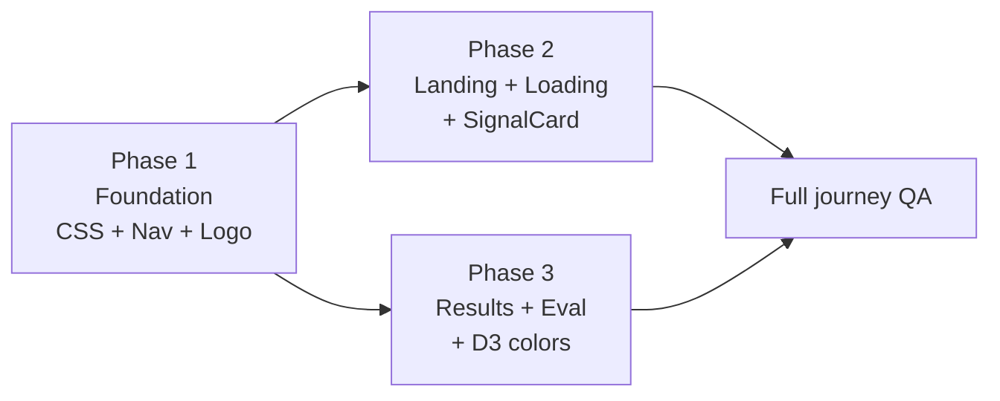

# Slopify — Clarity Intelligence Theme Migration

**Source spec:** [new-theme.md](./new-theme.md)  
**Author:** Team Avenger  
**Theme name:** Clarity Intelligence  
**Purpose:** Break the full UI reconstruction into **3 implementation phases** with deep analysis, file scope, tasks, and acceptance criteria.

---

## Executive summary

The current Slopify frontend uses a **dark neon cyberpunk** aesthetic (`landing.css` + dark `globals.css`). The new theme **Clarity Intelligence** shifts to a **refined analytical luxury** platform: warm beige pages, navy structure, teal precision accents, and editorial typography (DM Serif Display + Plus Jakarta Sans + DM Mono).

| Dimension | Current (Neon) | Target (Clarity Intelligence) |
|-----------|----------------|-------------------------------|
| Mood | Hacker terminal, glow, matrix rain | Intelligence briefing, cards, whitespace |
| Landing background | Fixed dark neon + particles | Navy hero + beige body sections |
| Dashboard background | `#050508` near-black | `#F0EDE6` warm beige |
| Primary accent | Cyan `#00f3ff`, pink `#ff2a6d` | Teal `#0D9488`, sky `#38BDF8` |
| Display font | Space Grotesk / Inter | DM Serif Display |
| UI font | Inter | Plus Jakarta Sans |
| Data font | JetBrains Mono | DM Mono |
| Score colors | Neon green/amber/red | Emerald/amber/red (semantic) |
| Hero device | Fake terminal + scanline | HeroPanel with metric bars |
| Loading | Matrix canvas rain | Navy grid + step list + ring |

**Logic unchanged:** `useRepoAnalysis.js`, `repoUrl.js`, `App.jsx`, routes, API contracts.

---

## Theme analysis (deep dive)

### Design philosophy

1. **Trust through clarity** — Light surfaces, readable ink-on-paper contrast, no aggressive glow. Users should feel they are reading a professional report, not a game UI.
2. **Hierarchy through cards** — Every dashboard block is a white/beige card with subtle shadow and border; sections are scannable.
3. **Data-forward navy anchors** — Nav bar, case header, hero, and tooltips use `navy-900` for authority without returning to full dark mode everywhere.
4. **Teal as the single action color** — CTAs, active nav, progress rings, and chart trend lines converge on teal; sky blue is secondary (links, GitHub hover).
5. **Semantic scoring** — High/mid/low engagement uses emerald/amber/red with matching soft backgrounds (`--score-*-bg`) for badges and cells.

### Positioning shift (copy & UX)

| Element | Old voice | New voice |
|---------|-----------|-----------|
| Hero eyebrow | "NEURAL SIGNAL EXTRACTION PROTOCOL" | "Code Comprehension Intelligence" |
| Headline | "Does your code have a **pulse**_" | "Was your code **actually** understood before it merged?" |
| CTA | "INITIALIZE SCAN" / "EXTRACT SIGNALS" | "Analyze" |
| Nav scanning | "analyzing evidence..." | "Analyzing…" |
| Product framing | Biometric / consciousness / forensic drama | Comprehension intelligence / behavioral git signals |

### Layout architecture (new)

```
┌─────────────────────────────────────────────────────────────┐
│ NAVBAR (sticky, navy-900, 60px)                              │
├─────────────────────────────────────────────────────────────┤
│ LANDING /                                                    │
│  ┌─ hero-section (navy-900, 2-col grid) ─────────────────┐  │
│  │  Left: eyebrow, serif headline, input row, demos       │  │
│  │  Right: HeroPanel (grade, metrics, bar chart)         │  │
│  └──────────────────────────────────────────────────────┘  │
│  stats-strip (5 metrics, beige)                             │
│  how-it-works (3 steps, white cards)                        │
│  signals-section (3×2 grid, SignalCard)                     │
│  flags-section (3×2 grid, severity chips)                   │
│  cta-section (navy band, second input)                      │
│  landing-footer (navy, links)                               │
├─────────────────────────────────────────────────────────────┤
│ RESULTS /                                                    │
│  case-header (navy card) → collapse banner → stat grid       │
│  era panel → sections (timeline, histogram, 2-col, heatmap) │
│  commit inspector (conditional)                             │
├─────────────────────────────────────────────────────────────┤
│ EVAL /                                                       │
│  eval-header → engagement CM → flag F1 table → failures      │
└─────────────────────────────────────────────────────────────┘
```

### Color token map (migration reference)

| Role | Old token | New token |
|------|-----------|-----------|
| Page bg | `--bg-primary` `#050508` | `--bg-page` `#F0EDE6` |
| Card bg | `--bg-secondary` | `--bg-card` `#FFFFFF` |
| Body text | `--text-primary` `#e8e8f0` | `--text-primary` `#0B1929` (navy on light) |
| Primary CTA | `--red` neon | `--accent` teal `#0D9488` |
| High score | `#39ff14` | `#059669` |
| Mid score | `#ffd700` | `#D97706` |
| Low score | `#ff2a6d` | `#DC2626` |
| GPT-4 line (chart) | `#a5a3e8` | `#7C3AED` |

### Components removed vs added

| Removed | Added / replaced |
|---------|------------------|
| `NeonBackground` (orbs, particles, rings) | `hero-bg-grid`, `hero-blob-1/2` (subtle) |
| `TerminalLine` fake console | `HeroPanel` sample metrics UI |
| `NeonStat` ticker | `STATS` strip with icons |
| Matrix rain `LoadingScreen` canvas | `fl-grid-bg` + step list |
| `.landing-neon` root class | `.landing-root` |
| Scan-line body overlay (`body::before`) | Removed (clean body) |
| `siren-pulse` animation | `pulse-dot` / teal border flash |

### Optional dependency

`new-theme.md` suggests **lucide-react** for icons on the new landing (Brain, Zap, Shield, etc.). Phase 2 can use inline SVGs or add:

```bash
npm install lucide-react
```

---

# Phase 1 — Foundation & Design System

**Goal:** Establish tokens, fonts, and shared chrome so every route immediately reflects the new brand — even before landing/results content is rebuilt.

**Estimated effort:** Medium (large CSS files, low JSX risk)  
**Depends on:** Nothing  
**Blocks:** Phases 2 and 3

---

## Phase 1 objectives

1. Load new Google Fonts globally.
2. Replace **all** design tokens and dashboard styles in `globals.css`.
3. Replace **all** landing layout styles in `landing.css` (styles only; old JSX class names may not match until Phase 2).
4. Ship new **NavBar** and **Logo** on every route.
5. Remove dark-theme artifacts (CRT scan lines, neon variables).

---

## Phase 1 — Files & actions

### 1.1 `frontend/index.html`

| Task | Detail |
|------|--------|
| Update `<title>` | `Slopify — Code Comprehension Intelligence` |
| Meta description | Comprehension-focused copy (see new-theme §1) |
| OG tags | Title, description, `og:url`, optional `og:image` |
| Font link | DM Serif Display + Plus Jakarta Sans + DM Mono (weights 400–800) |
| Remove | Old Inter / Space Grotesk / JetBrains-only setup |

**Acceptance:** Network tab shows three font families loading; no FOUT on serif headlines after refresh.

---

### 1.2 `frontend/src/styles/globals.css` — **Full replacement**

**~1,200 lines** in spec. Sections to implement in order:

| Section | CSS blocks | Purpose |
|---------|------------|---------|
| Reset + `:root` | Tokens | All `--navy-*`, `--teal-*`, `--beige-*`, semantic bg/text, shadows, radii |
| `body` | Base | Beige page, sans font, no scan-line overlay |
| **Navbar** | `.navbar`, `.nav-brand*`, `.nav-link*`, `.nav-pulse*` | Sticky navy bar, teal accents |
| **Results shell** | `.results-shell`, `.case-header`, `.case-*` | Max-width 1240px, navy case strip |
| **Sections** | `.section`, `.section-header`, `.section-body`, `.section-dark` | Card wrappers for dashboard |
| **Summary stats** | `.stat-grid`, `.stat-card`, `.grade-*`, `.verdict-bar` | 6-col grid, grade colors A–F |
| **Timeline container** | `.timeline-container` | White card padding for D3 SVG |
| **Inspector** | `.inspector-*`, `.score-bar-*`, `.diff-stat-*`, `.flag-chip*` | Commit detail panel |
| **Flag list** | `.flag-table`, `.flag-chip-*`, `.flag-filter-*` | Table + filter chips |
| **Contributor** | `.contributor-table`, sparkline container | Table layout |
| **File heatmap** | `.fhm-*` | Bar rows |
| **Era panel** | `.era-panel`, `.era-columns`, `.era-verdict-*` | Pre/post AI split |
| **Collapse banner** | `.collapse-banner`, `.cb-*` | Alert strip |
| **Loading** | `.fullscreen-loader`, `.fl-*` | Navy fullscreen loader (styles ready for Phase 2 JSX) |
| **Eval** | `.eval-page`, `.eval-section`, `.confusion-*`, `.failure-*`, `.flag-metrics-table` | Bake-Off page |
| **Errors** | `.results-error`, `.btn-primary`, `.btn-outline` | Error state + buttons |
| **Utilities** | `.text-high`, `.bg-high`, score helpers | Shared score classes |

**Critical removals from old globals:**

- Delete `body::before` CRT scan-line overlay.
- Remove `--red` neon as primary accent; map to `--score-low` or `--accent`.
- Replace `framer-motion` stat `siren-pulse` with subtle top-border teal flash on `.stat-card::before`.

**Acceptance:**

- Visit `/eval` after Phase 1 — page is readable on beige with new tables (even if layout JSX still uses some old class names where remapped).
- NavBar shows navy + “Intelligence” badge + teal “Accuracy” link.
- No pink/cyan neon anywhere in shared chrome.

---

### 1.3 `frontend/src/styles/landing.css` — **Full replacement**

**~800 lines** in spec. Structure:

| Block | Classes | Visual |
|-------|---------|--------|
| Base | `.landing-root` | Beige-100 min-height page |
| Hero | `.hero-section`, `.hero-inner` (grid) | Navy full-width hero |
| Hero BG | `.hero-bg-grid`, `.hero-blob-*` | Subtle grid + radial glows |
| Hero copy | `.hero-eyebrow`, `.hero-headline`, `.hero-sub` | Serif headline, white text |
| Hero input | `.hero-input-row`, `.hero-scan-btn`, `.hero-depth-select` | White input on dark hero |
| Hero panel | `.hero-panel`, `.hero-panel-bar`, metrics | Right column mock dashboard |
| Stats strip | `.stats-strip`, `.stats-strip-item` | 5 columns, white cards |
| How it works | `.how-section`, `.how-step`, `.how-step-num` | 3 steps horizontal |
| Signals | `.signals-section`, `.signals-grid`, `.signal-card*` | 3×2 card grid styles |
| Flags | `.flags-section`, `.flag-card*`, severity modifiers | Danger/warning/info |
| CTA | `.cta-section`, `.cta-inner` | Navy band, repeat scan |
| Footer | `.landing-footer`, `.footer-*` | Navy footer, grid links |
| Animations | `@keyframes pulse-dot`, `hero-panel-bar` grow | Subtle motion |
| Responsive | `@media` breakpoints | Collapse hero grid < 1000px |

**Note:** Until Phase 2 updates `LandingPage.jsx`, many `.neon-*` classes will be unstyled — **do not deploy Phase 1 alone without Phase 2** if landing is production-critical.

**Acceptance:** CSS file contains zero `.neon-` class definitions (clean break).

---

### 1.4 `frontend/src/components/NavBar.jsx` — **Full rewrite**

| Change | Detail |
|--------|--------|
| Classes | `.navbar`, `.nav-brand`, `.nav-brand-name`, `.nav-brand-badge`, `.nav-links`, `.nav-link`, `.nav-link-primary`, `.nav-pulse` |
| Brand | Logo + “Slopify” + badge “Intelligence” |
| Links | “New Scan” (on `/results` only), “Accuracy” → `/eval`, GitHub external |
| Icons | Inline SVG (arrow, chart, GitHub) — optional lucide in Phase 2 |
| Remove | Old `.nav-logo-text`, `.nav-link-muted`, `.nav-gh` |

**Acceptance:** All three routes show consistent navy nav; scanning state shows teal pulse dot.

---

### 1.5 `frontend/src/components/Logo.jsx` — **Color update only**

| Change | Detail |
|--------|--------|
| Gradients | Teal `#0D9488` + sky `#38BDF8` stops |
| Remove | Neon pink/cyan gradient stops |
| Filter | `feFlood` / glow uses teal, not `#ff2a6d` |

**Acceptance:** Logo reads clearly on navy nav and beige footer.

---

### 1.6 `frontend/public/favicon.svg` (optional in Phase 1)

- Navy circle `#0B1929`, teal branch metaphor `#0D9488`.
- Can slip to Phase 3 if time-constrained.

---

## Phase 1 — Do NOT touch yet

| File | Reason |
|------|--------|
| `LandingPage.jsx` | Phase 2 — class names change entirely |
| `LoadingScreen.jsx` | Phase 2 — structure change |
| `SignalCard.jsx` | Phase 2 — new props shape (`icon` string, `bg`) |
| D3 components | Phase 3 — hex swaps only |
| `useRepoAnalysis.js` | No changes per spec |

---

## Phase 1 — Verification checklist

- [ ] `npm run build` succeeds
- [ ] `/eval` renders with new eval styles
- [ ] NavBar correct on `/`, `/results`, `/eval`
- [ ] No console errors from missing CSS variables
- [ ] Fonts: serif on `.nav-brand-name` and eval titles
- [ ] Lighthouse: contrast check on nav links (WCAG AA on navy)

---

# Phase 2 — Marketing Surface & Loading Experience

**Goal:** Rebuild the **landing page** and **loading screen** to match Clarity Intelligence — the primary user entry and the scan wait state.

**Estimated effort:** High (largest JSX rewrite)  
**Depends on:** Phase 1 (`landing.css`, `globals.css` loader classes, NavBar)  
**Blocks:** None (can parallelize with Phase 3 after Phase 1)

---

## Phase 2 objectives

1. Replace `LandingPage.jsx` structure and copy with new sections.
2. Remove all neon-specific subcomponents (`NeonBackground`, `TerminalLine`, `NeonStat`).
3. Implement `HeroPanel`, stats strip, “How it works”, updated `SIGNALS`/`FLAGS` data.
4. Rewrite `SignalCard.jsx` for new card design.
5. Rewrite `LoadingScreen.jsx` without canvas matrix rain.
6. Optional: add `lucide-react` for icons.

---

## Phase 2 — Landing page structure (section by section)

### 2.1 Root & imports

```jsx
// Remove: import '../styles/landing.css' still via main.jsx — OK
// Remove: all IconPulse…IconEye inline neon icons (or repurpose)
// Add: HeroPanel, optional lucide-react
// Root class: landing-root (NOT landing-neon)
```

### 2.2 Section map (top → bottom)

| Order | Section class | Content | Motion |
|-------|---------------|---------|--------|
| 1 | `hero-section` | Eyebrow, headline, subcopy, input row, demo pills | `framer-motion` stagger on left |
| 1b | `hero-panel` (right) | Mock grade B+, mean score, P&P count, bar chart | Slide in from right |
| 2 | `stats-strip` | 5 items: signals, commits, scan time, flags, open source | `fadeUp` on scroll |
| 3 | `how-section` | 3 steps: Paste URL → Extract signals → Get report | Cards with numbered steps |
| 4 | `signals-section` | 6 × `SignalCard` (updated SIGNALS constant) | Grid + `useInView` per card |
| 5 | `flags-section` | 6 flag cards with severity styling | Grid |
| 6 | `cta-section` | Repeat headline + input + Analyze button | Centered |
| 7 | `landing-footer` | Logo, tagline, links (Accuracy, GitHub) | Static |

### 2.3 Hero input behavior (unchanged logic)

| Function | Behavior |
|----------|----------|
| `handleScan(repoUrl)` | Uses `analysis.analyze(url, { maxCommits: depth })` |
| State `url`, `depth` | 50 / 100 / 200 commits |
| Error display | `.hero-error` below input if `analysis.error` |
| Demo pills | `DEMO_REPOS` — morgan, cors, ora |

### 2.4 `HeroPanel` subcomponent (new)

**Purpose:** Replace fake terminal — show plausible preview of results UI.

| Element | Position in panel |
|---------|-------------------|
| Window chrome dots | Top-left (macOS style) |
| Label | `Cognitive Analysis · expressjs/morgan` |
| Metric grid | 4 cells: Grade, Mean, P&P flags, High Engage % |
| Bar chart | 16 animated `.hero-panel-bar` divs |

**Data:** Static demo values in spec (not live API).

### 2.5 Updated content constants

**SIGNALS (6)** — renamed for analytical tone:

| ID | New name | Color accent |
|----|----------|--------------|
| SIG-01 | Cognitive Entropy | Teal |
| SIG-02 | Semantic Novelty | Sky |
| SIG-03 | Commit Velocity Decay | Purple |
| SIG-04 | Message Quality Score | Amber |
| SIG-05 | Test Surface Coverage | Emerald |
| SIG-06 | Diff Coherence Index | Red |

**FLAGS (6)** — severity: `danger` | `warning` | `info`

**STATS (5)** — for strip below hero

### 2.6 Deleted from old LandingPage

| Remove | Reason |
|--------|--------|
| `NeonBackground` | Replaced by CSS grid/blobs |
| `TerminalLine` | No fake terminal |
| `NeonStat` | Replaced by `stats-strip` |
| `.neon-*` class names | All migrated to new BEM |
| Problem/quote long section layout | Replaced by `how-section` (per spec) |

**Note:** Old landing had extra “problem” + quote section; new spec uses **How it works** instead — follow new-theme JSX, not a 1:1 section count match.

---

## Phase 2 — `SignalCard.jsx` rewrite

| Prop | Type | Usage |
|------|------|-------|
| `signal.id` | string | e.g. `SIG-01` |
| `signal.name` | string | Display title |
| `signal.icon` | string | Key into `ICON_MAP` (lucide or SVG) |
| `signal.color` | string | Accent border/text |
| `signal.bg` | string | Icon background rgba |
| `signal.desc` | string | Body copy |
| `index` | number | Stagger delay |

**Classes:** `.signal-card`, `.signal-card-icon`, `.signal-card-name`, `.signal-card-desc`, `.signal-card-id`

**Animation:** `useInView` → `.in-view` class (CSS handles fade/slide)

---

## Phase 2 — `LoadingScreen.jsx` rewrite

| Aspect | Old | New |
|--------|-----|-----|
| Background | Dark + matrix canvas | Navy `.fullscreen-loader` + `.fl-grid-bg` |
| Progress | SVG ring + Logo | CSS `.fl-ring-outer` + horizontal `.fl-progress-bar` |
| Stage text | `STAGE_LABELS` map | Keep mapping; same backend `stage` keys |
| Extra UI | Radar, matrix | **Step list** (5 steps with dots) |
| Remove | `useEffect` canvas loop | Delete entirely |

**Props unchanged:** `progress`, `stage`, `updatedAt` — compatible with `useRepoAnalysis` job polling.

**Step list logic:** Map `stage` string to active/done on steps: init → fetch → analyze → score → complete.

---

## Phase 2 — Files touched

| File | Action |
|------|--------|
| `LandingPage.jsx` | **Full rewrite** |
| `SignalCard.jsx` | **Full rewrite** |
| `LoadingScreen.jsx` | **Full rewrite** |
| `package.json` | Optional: add `lucide-react` |

---

## Phase 2 — Verification checklist

- [ ] `/` hero: input, depth select, Analyze, demo pills work
- [ ] Scan navigates to `/results?repo=...` and shows new loader
- [ ] Loader reaches 100% and transitions to dashboard
- [ ] No reference to `.neon-` classes in LandingPage
- [ ] Mobile: hero stacks (grid → 1 col)
- [ ] `framer-motion` scroll sections animate once
- [ ] Footer links work (`/eval`, GitHub)

---

# Phase 3 — Analytics Dashboard & Evaluation UI

**Goal:** Align **results dashboard**, **D3 charts**, and **eval page** with new tokens — mostly class remaps and color swaps; minimal logic changes.

**Estimated effort:** Medium–High (many files, touch each visual)  
**Depends on:** Phase 1 (`globals.css` must exist)  
**Can start:** After Phase 1, in parallel with Phase 2

---

## Phase 3 objectives

1. Wrap results layout in new section/card structure.
2. Update all score color helpers to CSS variables.
3. Swap D3 palettes in timeline and histogram.
4. Remap class names on analytical components.
5. Polish eval page structure and confusion matrix / failure gallery.
6. Final QA across full user journey.

---

## Phase 3 — Results page (`ResultsPage.jsx`)

**Logic:** Unchanged (auto-scan from URL, `selectedCommit`, retry).

| Area | Change |
|------|--------|
| Case header | Replace inline styles → `.case-header`, `.case-id`, `.case-repo`, `.case-meta` |
| Sections | Wrap each block in `.section` > `.section-header` + `.section-body` |
| Error UI | `.results-error`, `.results-error-icon` (⚠), `.btn-primary` / `.btn-outline` |
| Score helpers | Add shared `scoreColor(s)` / `scoreBg(s)` using CSS vars |

**Component order (unchanged):**

1. Case header  
2. CollapseEventBanner  
3. SummaryStats  
4. EraPanel  
5. ScoreHistogram  
6. TimelineView  
7. Two-col: ContributorMatrix | FlagList  
8. FileHeatMap  
9. CommitInspector (conditional)

---

## Phase 3 — Component-by-component

### 3.1 `SummaryStats.jsx`

| Task | Detail |
|------|--------|
| Classes | Keep `.stat-grid`, `.stat-card`; use `.grade-a`…`.grade-f` for grade |
| Colors | `var(--score-high)`, `--score-mid`, `--score-low` instead of hex neon |
| Animation | Replace `siren-pulse` with teal top-border pulse on warning stats |
| Verdict | `.verdict-bar` with semantic border color |

### 3.2 `TimelineView.jsx` — D3 only

| Element | Old hex | New hex |
|---------|---------|---------|
| High score dots | `#39ff14` | `#059669` |
| Low score dots | `#ff2a6d` | `#DC2626` |
| Score scale | neon green→red | `#059669`→`#DC2626` |
| GPT-4 line | `#a5a3e8` | `#7C3AED` |
| Trend line | `#7a7a9d` | `#0D9488` |
| Collapse band | pink rgba | `rgba(220,38,38,0.08)` |
| Tooltip bg | `#0c0c14` | `#0B1929` + teal border |
| Axis text | `#7a7a9d` | `#64748B` / `#94A3B8` |

**No change** to click handlers, tooltip structure, or `rollingMean`.

### 3.3 `ScoreHistogram.jsx` — D3 only

| Element | New |
|---------|-----|
| Scale ends | `#DC2626` → `#059669` |
| Mean line | `#0F2D4A` |
| Wrapper | Uses inline styles in component — align to `.section-body` or card bg white |

### 3.4 `CommitInspector.jsx`

| Old class prefix | New prefix |
|------------------|------------|
| `.inspector-card` | keep + `.evidence-tape` optional remove |
| `.inspector-*` | map to globals `.inspector-*` |
| `FLAG_META` colors | Update to semantic hex or vars |

### 3.5 `FlagList.jsx`

| Task | Detail |
|------|--------|
| Layout | Table `.flag-table` / chips `.flag-chip-*` per globals |
| `FLAG_COLOR` map | `#DC2626`, `#D97706`, `#059669` |
| Filter bar | `.flag-filter-btn` |

### 3.6 `ContributorMatrix.jsx`

| Task | Detail |
|------|--------|
| Table | `.contributor-table`, header row |
| Sparkline stroke | Use `scoreColor(c.mean_score)` |
| Trend icons | ↘ ↗ → with semantic colors |

### 3.7 `FileHeatMap.jsx`

| Task | Detail |
|------|--------|
| Rows | `.fhm-row`, `.fhm-bar-fill`, `.fhm-score` |
| Colors | score-based bar fills |

### 3.8 `EraPanel.jsx`

| Task | Detail |
|------|--------|
| Wrapper | `.era-panel`, `.era-columns` |
| Verdict | `.era-verdict-bar` with dynamic border color |
| Text on light cards | Navy/ink text (not white) |

### 3.9 `CollapseEventBanner.jsx`

| Task | Detail |
|------|--------|
| Classes | `.collapse-banner`, `.cb-title`, `.cb-jump`, `.cb-dismiss` |
| Icon | SVG warning (keep) |
| Motion | `framer-motion` slide-in (keep) |

### 3.10 `EvalPage.jsx`

| Task | Detail |
|------|--------|
| Wrapper | `.eval-page` |
| Header | `.eval-header`, `.eval-eyebrow`, `.eval-title`, `.eval-sub` |
| Sections | `.eval-section`, `.eval-section-title` |
| Table | `.flag-metrics-table` |
| Refresh btn | `.btn-outline` or `.share-btn` restyle |

### 3.11 `ConfusionMatrix.jsx`

| Task | Detail |
|------|--------|
| Grid | `.confusion-grid` |
| Cells | `.confusion-cell`, `.cm-tp`, `.cm-fp`, `.cm-fn` type classes |
| Remove | Old `.cm-grid` if renamed in globals |

### 3.12 `FailureGallery.jsx`

| Task | Detail |
|------|--------|
| Cards | `.failure-card`, `.failure-fp`, `.failure-fn` |
| Subcomponents | `FailureCard` uses new header/body classes |

### 3.13 `RepoInput.jsx` (optional cleanup)

- Not used by current routes; either delete or restyle with `.hero-input-row` patterns for future use.

### 3.14 `favicon.svg`

- Teal on navy mark; deploy with Phase 3 polish.

---

## Phase 3 — Cross-cutting score helpers

Add to a tiny util or duplicate in components:

```javascript
export const scoreColor = (s) =>
  s >= 0.60 ? 'var(--score-high)' :
  s >= 0.35 ? 'var(--score-mid)' :
              'var(--score-low)';

export const scoreBg = (s) =>
  s >= 0.60 ? 'var(--score-high-bg)' :
  s >= 0.35 ? 'var(--score-mid-bg)' :
              'var(--score-low-bg)';
```

Consider `frontend/src/utils/scoreColors.js` (new file, optional).

---

## Phase 3 — End-to-end verification

| Journey | Check |
|---------|-------|
| Landing → scan | Phase 2 loader → Phase 3 results cards |
| Results interactions | Timeline click → inspector; flag filter; collapse jump |
| Era panel | Shows on repo spanning Mar 2023 |
| Eval page | CM numbers readable; refresh works |
| Error paths | Invalid URL, API down, job 404 |
| Responsive | `two-col` → 1 col < 860px; stat grid 3→2 cols |
| Build | `npm run build`; Vercel preview |
| a11y | Focus states on buttons; contrast on beige |

---

## Phase dependency diagram



**Recommended execution order:**

1. **Phase 1** completely  
2. **Phase 2** + **Phase 3** in parallel (two developers) OR Phase 2 then Phase 3  
3. Final QA pass on staging Vercel

---

## File touch matrix (all phases)

| File | Phase 1 | Phase 2 | Phase 3 |
|------|---------|---------|---------|
| `index.html` | ● | | |
| `globals.css` | ● replace | | |
| `landing.css` | ● replace | | |
| `NavBar.jsx` | ● rewrite | | |
| `Logo.jsx` | ● colors | | |
| `LandingPage.jsx` | | ● rewrite | |
| `SignalCard.jsx` | | ● rewrite | |
| `LoadingScreen.jsx` | | ● rewrite | |
| `SummaryStats.jsx` | styles in P1 | | ● remap |
| `ResultsPage.jsx` | | | ● wrappers |
| `TimelineView.jsx` | | | ● D3 |
| `ScoreHistogram.jsx` | | | ● D3 |
| `CommitInspector.jsx` | styles in P1 | | ● remap |
| `FlagList.jsx` | styles in P1 | | ● remap |
| `ContributorMatrix.jsx` | styles in P1 | | ● remap |
| `FileHeatMap.jsx` | styles in P1 | | ● remap |
| `EraPanel.jsx` | styles in P1 | | ● remap |
| `CollapseEventBanner.jsx` | styles in P1 | | ● remap |
| `EvalPage.jsx` | styles in P1 | | ● structure |
| `ConfusionMatrix.jsx` | styles in P1 | | ● remap |
| `FailureGallery.jsx` | styles in P1 | | ● remap |
| `favicon.svg` | ○ optional | | ● |
| `useRepoAnalysis.js` | — | — | — |
| `App.jsx` | — | — | — |

● = required · ○ = optional

---

## Risk register

| Risk | Mitigation |
|------|------------|
| Deploy P1 without P2 breaks landing (missing `.neon-*` styles) | Deploy P1+P2 together, or feature-flag route |
| Large CSS diff hard to review | Review tokens first, then section-by-section |
| D3 colors missed in tooltip/gradient | Grep for `#39ff14`, `#ff2a6d`, `#00f3ff` after Phase 3 |
| `lucide-react` bundle size | Tree-shake imports per icon |
| Dark mode users | Out of scope; light-first product |

---

## Success criteria (theme complete)

- [ ] Zero neon class names in JSX (`neon-`, `landing-neon`)
- [ ] All pages usable on beige + navy system
- [ ] Single accent family (teal) for actions
- [ ] Typography matches spec (serif hero, sans UI, mono data)
- [ ] Hackathon demo: landing → scan → dashboard → eval reads as one product
- [ ] README screenshot / video reflects new UI

---

*Derived from [new-theme.md](./new-theme.md) · Team Avenger · Clarity Intelligence migration plan.*
